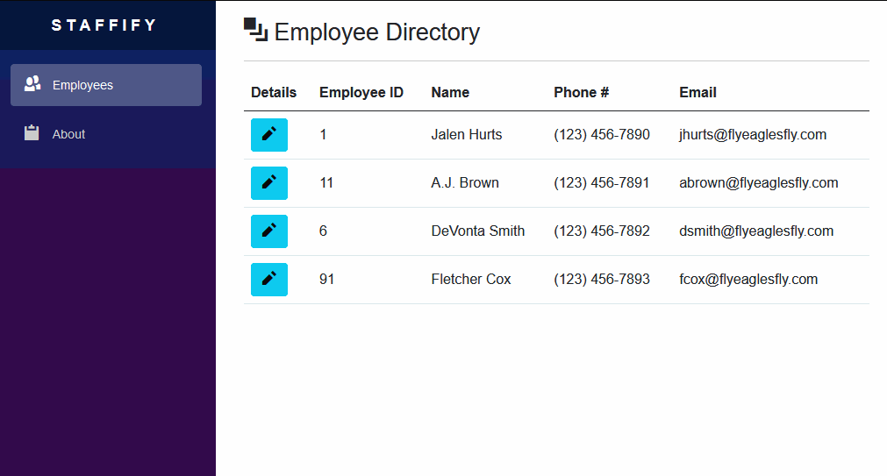

# WRM Software Assessment

    
    
    

 

This repository features the project Staffify. Staffify is a web application used as a simple employee directory. This application satisfies the requirements on the assessment.

## :sparkler: Quick Start

To run this program you will need these items:

| Item | Link | As of the Initial Release|
| --- | --- | --- |
| .NET 6 SDK | [Get the latest version](https://dotnet.microsoft.com/en-us/download/dotnet/6.0) | .NET SDK is on v6.0.402 |
| This Repository | [Download](https://github.com/zachsanford/WRM-Software-Assessment/archive/refs/heads/main.zip) | v0.1.0 |

Download the latest .NET 6 SDK and install it. Afterward download this repository. Unzip the downloaded repository. Open a Terminal/PowerShell/Command Prompt and navigate to `~\Staffify\` and run the command `dotnet watch run`

This will start the webserver and open a web browser to the index page of Staffify. [^1]

For a deeper look into the Staffify, please visit the :book: [Wiki](https://github.com/zachsanford/WRM-Software-Assessment/wiki).

[^1]: Your web browser may issue a warning about the web page. Click on "Advanced" and then "Proceed to web page".
